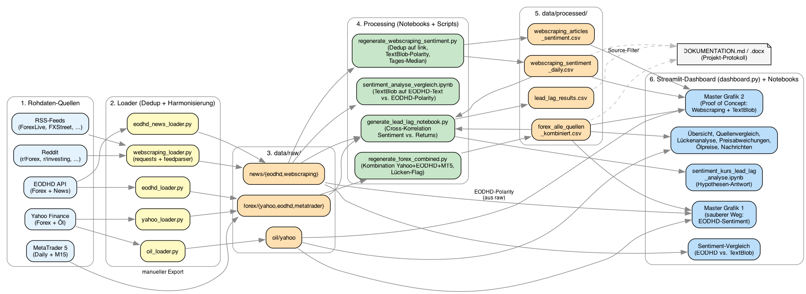

# Projekt-Dokumentation: Forex, News-Sentiment & Ölpreise

**Modul:** Data Engineering & Wrangling, BAI, FHNW (26FS)
**Zeitraum der Daten:** 2022-01-01 bis 2026-04-22
**Stand des Dokuments:** 2026-05-06

---

## 1. Projektziel und Fragestellung

Das Projekt untersucht, ob sich zwischen **Wechselkursen** (EUR/USD, EUR/CHF, GBP/USD), **Finanznachrichten-Sentiment** und **Ölpreisen** ein nachvollziehbarer Zusammenhang erkennen lässt.

### Hypothese

> *Hat das Sentiment von Finanznachrichten einen Einfluss auf Währungskurse — und wenn ja, wie viel?*

Methodisch konkretisiert in eine **Lead/Lag-Frage**:

- **Hypothese H1** (Sentiment führt): Sentiment am Tag $t$ sagt Returns am Tag $t+k$ vorher (für ein $k > 0$). Wenn negative News heute auftauchen, fällt der Kurs in den folgenden Tagen.
- **Alternative A1** (gleichzeitig): Sentiment und Returns bewegen sich gemeinsam ($k = 0$), Sentiment ist Begleitinformation, kein Vorlauf.
- **Alternative A2** (Markt führt): Returns laufen Sentiment voraus ($k < 0$), die News reagieren auf den Markt, nicht umgekehrt.

Die Operationalisierung erfolgt im Notebook `notebooks/datenverarbeitung/sentiment_kurs_lead_lag_analyse.ipynb`. Resultate stehen in Abschnitt 12.

### Wie der Dozent das Projekt geframet hat

Bewertet wird **nicht das Prognose-Modell**, sondern der Umgang mit unsauberen Daten: aus heterogenen Quellen vergleichbare Reihen bauen, Qualitätsprobleme erkennen und dokumentieren, Methodenentscheidungen begründen. Die Hypothesen-Antwort ist ein Anwendungsbeispiel; die Datenaufbereitung ist das eigentliche Produkt.

Die Pflicht-Verarbeitungsschritte gemäss Vorgaben-Folie sind: **Datenbereinigung, Datentransformation, Qualitätsprüfung, Pipeline, Visualisierung, Analyse** — diese gliedern auch die Doku (Abschnitte 4–12).

### Was das Projekt **nicht** ist

- Kein Trading-System, kein Backtesting.
- Kein Maschinelles-Lernen-Modell.
- Keine Kausalaussage ("Sentiment verursacht Kursbewegung"), sondern eine deskriptive Beobachtung zeitlicher Vorhersagbarkeit. Granger-Causality oder ökonometrische Identifikation sind in Sektion 12 als Erweiterung vermerkt, aber nicht implementiert.

---

## 2. Datenquellen

Es wurden bewusst **mehrere Quellen** pro Datentyp integriert, damit Unstimmigkeiten aufgedeckt werden können und die Abhängigkeit von einer einzelnen Quelle vermieden wird.

| Datentyp | Quelle | Zugang | Historie im Repo |
|---|---|---|---|
| Forex | Yahoo Finance | `yfinance` (ohne Auth) | 2022-01-03 – 2026-04-21 |
| Forex | EODHD | REST-API mit API-Key | 2022-01-02 – 2026-04-22 |
| Forex | MetaTrader 5 | Manuelle CSV-Exporte (Daily + M15) | 2022-01-03 – 2025-12-26 |
| News | EODHD | REST-API, Tagesfeld, vorberechnete Polarity | 2022-01 – 2026-04 |
| News | RSS-Feeds (ForexLive, FXStreet, Yahoo Finance, Google News, DailyFX) | `requests` + `feedparser` | Scrape-Schnappschüsse von 2024-09 bis 2026-04 |
| News | Reddit (r/Forex, r/investing, r/economics) | JSON-Endpunkt | Gleiches Fenster wie RSS |
| Öl | Yahoo Finance (WTI `CL=F`, Brent `BZ=F`) | `yfinance` | 2022-01-03 – 2026-04-21 |

### Warum diese Kombination?

- **Yahoo + EODHD** — zwei unabhängige, öffentlich zugängliche Forex-Anbieter. Yahoo ist kostenlos, EODHD liefert zusätzlich Sonntagsdaten (globaler Forex öffnet Sonntag abends in Asien) und bringt das Nachrichten-Feed plus bereits aggregierte Sentiment-Werte. So sind Datenvergleich und Cross-Check möglich.
- **MetaTrader 5** — Broker-nahe Daten, die als „Ground Truth" für eine technische Sicht dienen. Werden hier nur für den **Quellenvergleich** (siehe Abschnitt 5.1) genutzt, nicht für die Sentiment-Korrelation, weil MT5-Daten nur lokal exportiert werden können und bis 2025-12-26 reichen.
- **EODHD-News** — fertig annotiert mit Polarity pro Artikel → schneller Einstieg und Referenz für eine eigene Sentiment-Analyse.
- **RSS + Reddit** — zweite, unabhängige Nachrichtenquelle für den Proof-of-Concept (siehe Abschnitt 8). Rohe Texte, keine vorberechneten Scores.
- **Öl (WTI + Brent)** — häufig genannter makroökonomischer Einflussfaktor auf Rohstoff- und Petro-Währungen. Dient im Dashboard als Overlay.

---

## 3. Architektur der Datenpipeline

```
┌──────────────┐   Loader   ┌────────────┐   Notebooks/   ┌────────────┐   Dashboard
│ externe APIs │ ─────────▶ │ data/raw/  │ ─ scripts/ ──▶ │data/process│ ───────────▶ Streamlit
│ (Yahoo, …)   │            │            │                │   ed/      │
└──────────────┘            └────────────┘                └────────────┘
```

Drei Schichten:

1. **`data/raw/`** — unveränderte Rohdaten. Jede Datei ist durch Quelle + Datum im Dateinamen identifizierbar. Keine Veränderung nach dem Laden.
2. **`data/processed/`** — harmonisierte, zusammengeführte Zwischenergebnisse. Produziert durch die Notebooks oder die Helper-Scripts in `scripts/`.
3. **`data/final/`** — fertige End-Datensätze, die in Bericht oder Dashboard einfließen.

**Reproduzierbarkeit:** Jeder Schritt kann mit einem einzigen Befehl neu ausgeführt werden. Siehe Abschnitt 13.

**Visualisierung:** Das Pipeline-Diagramm ist als Graphviz-Quelle in `docs/architektur/pipeline.gv` abgelegt; gerenderte Versionen liegen als `pipeline.png` und `pipeline.svg` daneben.



Im Dashboard ist dasselbe Diagramm interaktiv unter der Seite "Workflow" erreichbar. Render-Anleitung für eigene Anpassungen steht in `docs/architektur/README.md`.

---

## 4. Umgang mit fehlenden Werten

Der Umgang wurde für jeden Datentyp separat entschieden. Generelles Prinzip: **nur dort interpolieren, wo die Lücke technisch entsteht und nicht inhaltlich ist**.

### 4.1 Forex: Wochenenden und Feiertage

- **Samstage:** Fehlen bei allen Quellen, weil der Forex-Markt weltweit geschlossen ist. → nicht ausgefüllt, ist erwartet.
- **Sonntage:** EODHD liefert Werte (Markteröffnung Asien ab Sonntagabend UTC), Yahoo und MT5 nicht. → Sonntagsdaten werden **behalten**, wo vorhanden. Sie gehen als normaler Tag in Zeitreihen ein, weil sie reale Marktdaten sind.
- **Feiertage (z.B. 1. Januar, Karfreitag):** In Yahoo fehlend, in EODHD teilweise vorhanden. → **nicht interpoliert**, weil das den Markt zu diesem Zeitpunkt nicht repräsentiert. In der kombinierten Tabelle wird per `has_gap`-Flag markiert, dass eine Quelle fehlt.
- **Interpolation als Dashboard-Option:** Im Dashboard gibt es einen Schalter „Fehlende Tage interpolieren (linear, vor Aggregation)". Dieser wirkt **ausschließlich auf Forex- und Öl-Reihen**, niemals auf Sentiment. Außerdem wirkt er nur auf die Anzeige, schreibt keine Werte zurück. So bleibt die Rohdaten-Integrität gewahrt und der User sieht, wo der Effekt auftritt.

### 4.2 News-Sentiment: Tage ohne Artikel

- Wenn an einem Tag **kein Artikel** in EODHD oder im Webscraping-Pool vorliegt (typisch: Wochenenden, Feiertage, thin-news-Tage), bleibt die Sentiment-Zeitreihe **NaN**.
- **Kein Interpolieren — nirgends.** Weder im Rohdatenlayer noch im Processing, noch im Dashboard. Selbst wenn der User im Dashboard die Interpolations-Checkbox aktiviert, werden Sentiment-Reihen explizit ausgenommen.
- **Begründung methodisch (MNAR):** Die Vorlesung W2 (`slides/Folien.pdf`, S. 11) unterscheidet MCAR / MAR / MNAR. Tage ohne Artikel sind hier **MNAR**: ob ein Artikel existiert, hängt direkt davon ab, ob etwas passiert ist — also vom *fehlenden Wert selbst*. Imputation bei MNAR erzeugt strukturelle Verzerrung, weil "kein Artikel" inhaltlich **nicht** "neutraler Artikel" bedeutet. Eine Null-Imputation oder Zeit-Interpolation würde eine Nachrichtenlage vortäuschen, die es nicht gab.
- Die Slides empfehlen für Zeitreihen zwar grundsätzlich "vorherige oder zukünftige Werte zum Auffüllen" (W2, S. 16) — wir weichen für Sentiment **bewusst** davon ab, weil die Auffüll-Logik dort für stetige physikalische Grössen gedacht ist, nicht für ereignisbedingte Zähldaten.
- Bei der Aggregation auf Wochen/Monate ignoriert pandas NaN automatisch (`skipna=True`), d.h. Wochen mit 2 statt 5 News-Tagen werden weiterhin aggregierbar, nur eben auf Basis der vorhandenen Tage.

### 4.3 Öl-Daten

- Auch hier: Feiertage und Wochenenden fehlen, werden behalten als Marktereignisse. Keine Interpolation im Rohdatenlayer.

### 4.4 Sonderfall EUR/CHF-News

- Die EODHD-News-Abdeckung für EUR/CHF ist **extrem dünn** (ca. 13 Artikel im gesamten Zeitraum). Das liegt an der geringeren internationalen Medienaufmerksamkeit für dieses Paar.
- Keine Füllung möglich — und sinnvoll. Wir dokumentieren es offen und führen für EUR/CHF keine Sentiment-Korrelation durch, nur Forex-Quellenvergleich und Ölkontext. Im Bericht wird diese Einschränkung explizit genannt.

---

## 5. Umgang mit Duplikaten

### 5.1 Forex

- **Duplikate im Datumsindex** werden je Quelle mit `df[~df.index.duplicated(keep="first")]` entfernt. Ursache sind meist Zeitzonen-bedingte Mehrfacheinträge (z.B. Yahoo liefert EUR/USD mit 23:00-UTC-Zeitstempel, der durch das Runden auf den nächsten Tag kollidiert).
- **Inhaltliche Duplikate** (exakt gleiche OHLC-Werte an unterschiedlichen Tagen) werden *nicht* entfernt — sie können durch ruhige Marktphasen legitim entstehen, und ein automatisches Entfernen wäre gefährlich.

### 5.2 News

- **Webscraping:** Artikel erscheinen mehrfach in aufeinanderfolgenden Scrape-Schnappschüssen, solange sie im Feed stehen. Deduplikation erfolgt auf `link` (eindeutige URL) mit `drop_duplicates(subset="link", keep="first")`. Das ist robust, weil derselbe Artikel nicht mit unterschiedlichem Text existiert.
- **Nicht auf `title` dedupliziert**, weil RSS-Feeds denselben Artikel mit leicht unterschiedlich formatiertem Titel ausspielen können (z.B. mit/ohne Quellen-Suffix).
- **EODHD-News:** Die API liefert pro Artikel eine einzigartige Paginierung, echte Duplikate sind selten. Beobachtet: 0 Duplikate bei EUR/CHF, kleine Anzahl bei EUR/USD/GBP — werden über denselben Mechanismus entfernt.

### 5.3 Reddit-Spezifität

- Reddit-Posts können in `hot` und `new` gleichzeitig auftauchen. Der Loader erkennt das und entfernt die Duplikate direkt nach dem Scrape (Spalte `link`).

---

## 6. Datenharmonisierung

Ziel: Alle Quellen mit demselben Schema ansprechbar machen, damit ein Vergleich möglich ist.

**Theorie-Bezug (W4, `slides/W04_dwae.pdf`, S. 8):** Die Vorlesung unterscheidet drei Dimensionen der Heterogenität, an denen wir uns hier explizit ausrichten:

1. **Syntax** — unterschiedliche Datenformate (CSV, JSON, HTML, Tab-getrennt für MT5).
2. **Struktur** — unterschiedliche Schemas (Spaltenreihenfolgen, geschachtelte Dicts vs. flach).
3. **Semantik** — gleiche Begriffe, unterschiedliche Bedeutungen (z. B. "close" als New-York-Schluss vs. London-Schluss).

| Dimension (W4) | Ausgangslage | Harmonisierung |
|---|---|---|
| **Syntax — Zeitzone** | Yahoo UTC, EODHD naive lokal, MT5 Broker-TZ, RSS/Reddit je nach Feed | Alle auf timezone-naive normalisiert, auf Tagesebene gerundet (`.normalize()` oder `.ceil("D")` je nach Quelle) |
| **Struktur — Spaltennamen** | `Open/High/Low/Close` (Yahoo), `open/high/low/close` (EODHD), `<OPEN>/<HIGH>/…` (MT5) | Alle auf lowercase `open/high/low/close` |
| **Syntax — Datumsformat** | ISO-Strings, YYYY.MM.DD (MT5), Epoch-Sekunden (Reddit) | In `pd.Timestamp` via `pd.to_datetime(..., errors="coerce")` |
| **Semantik — Währungspaar-Schreibweise** | `EURUSD=X` (Yahoo), `EURUSD.FOREX` (EODHD), `EURUSD` (MT5) | Intern einheitlich `EUR_USD`, `EUR_CHF`, `GBP_USD` |
| **Struktur — News-Felder** | Sentiment als verschachteltes Dict (EODHD) vs. kein Sentiment (RSS) | `pd.json_normalize()` flattet das EODHD-Dict zu `polarity`, `neg`, `neu`, `pos` |

W4 (S. 13) kategorisiert die Harmonisierung als **retrospektiv** — sie passiert *nach* der Datenerhebung, weil wir keine Kontrolle über die Quellsysteme haben. Das ist gemäss Slide "die häufigste Form in der Praxis", limitiert aber die erreichbare Datenqualität (S. 15: Trade-offs zwischen Validität, Reliabilität, Abdeckung, Granularität).

Der harmonisierte Forex-Output liegt in `data/processed/forex/forex_alle_quellen_kombiniert.csv`: Ein Long-Format, in dem jede Zeile eine Paar-Datum-Kombination ist und Spalten wie `yahoo_close`, `eodhd_close`, `metatrader_close` nebeneinander stehen. Zusätzlich: `weekday`, `is_weekend`, `n_sources`, `has_gap` für spätere Filter.

---

## 7. Datentransformation & Feature Engineering

### 7.1 Aggregation auf Tagesebene (News)

- Tagesbasis = erste sinnvolle gemeinsame Auflösung mit Forex-Daten.
- Aggregation der Polarity über alle Artikel eines Tages: **Median** statt Mittel.
- **Begründung mit Slides-Bezug (W3, `slides/Folien 2.pdf`, S. 19/25):** Die Vorlesung empfiehlt für ausreisser-anfällige Daten den `RobustScaler`, der genau die Kombination Median + IQR verwendet — mit der Begründung "Ausreisser beeinflussen Median & IQR kaum → robustere Skalierung". Wir wenden dieselbe Logik auf die Tages-Aggregation der Polarity an: Ein einzelner Artikel mit extremer Polarity (±1.0) kann den Tagesmittelwert stark verziehen, der Median bleibt davon unbeeinflusst.
- **Quantitatives Bild der Verteilung:** Die Polarity-Werte sind nicht normalverteilt, sondern haben starke Konzentrationen bei 0 (TextBlob-Default für Texte ohne Lexikon-Treffer) und vereinzelte Extremwerte. Bei dieser Verteilungsform ist der Median fast immer aussagekräftiger als das Mittel.

### 7.2 Aggregation auf Wochen/Monate/Quartale

- Im Dashboard (Master Grafik 1 und 2) zur Wahl. Über `pd.DataFrame.resample` mit konfigurierbarer Aggregationsfunktion (Mittel, Median, Letzter, Min, Max, Summe).
- Fehlende Tage werden **nicht vorher gefüllt**; `resample` ignoriert NaN automatisch.
- Wochen beginnen Montag (`W-MON`), Monate/Quartale am Monatsanfang (`MS`, `QS`).

### 7.3 Normalisierung (Index=100)

- Dashboard-Feature, keine Rohdaten-Veränderung.
- Teilt jede Reihe durch ihren ersten gültigen Wert im Zeitraum und multipliziert mit 100. Dadurch werden Reihen mit sehr unterschiedlichen Skalen (Forex 1.15, Öl 80, Sentiment 0.1) optisch vergleichbar.

### 7.4 Forex-Mittelwert aus Yahoo+EODHD

- Im Dashboard per Dropdown wählbar („mittelwert" vs. einzelne Quelle).
- Mittelwert nur dort gebildet, wo **beide** Quellen Daten haben (`skipna=False`), damit kein Bias durch einseitige Tage entsteht.

### 7.5 MetaTrader M15 → Daily

- Die 15-Minuten-Bars werden im Forex-EDA-Notebook auf Tagesbasis aggregiert (`Open=first`, `High=max`, `Low=min`, `Close=last`). Validierungscheck: Die aggregierten Werte müssen mit dem separat gelieferten MT5-Daily-Export exakt übereinstimmen (100% Match in allen OHLC-Feldern). Dient als Sanity-Check für die Aggregationslogik.

---

## 8. Sentiment-Analyse: drei parallele Wege

Wir berechnen Sentiment auf **drei unterschiedliche Arten**, damit Methodenabhängigkeiten sichtbar werden.

### 8.1 EODHD-Polarity (vorberechnet)

- EODHD liefert pro Nachrichtenartikel bereits eine Polarity-Zahl in `[-1, 1]` plus separate Scores für negativ, neutral, positiv.
- Methode nicht öffentlich dokumentiert, wir behandeln sie als Black-Box-Quelle.
- Einsatz: Master Grafik 1 (saubere Methodik-Referenz).

### 8.2 Eigene TextBlob-Analyse auf EODHD-Text

- Wir nehmen **denselben** Artikeltext (Titel + Content) und lassen `textblob.TextBlob(text).sentiment.polarity` darüber laufen.
- Ergebnis wird mit der EODHD-Polarity verglichen (Notebook `sentiment_analyse_vergleich.ipynb`, Dashboard-Seite „Sentiment-Vergleich").
- Zweck: Ist die EODHD-Polarity ein mehr-oder-weniger-komplexes Modell? Wie nah kommt ein simples lexikonbasiertes Verfahren?

### 8.3 Eigene TextBlob-Analyse auf Webscraping-Text

- Titel + Summary der gescrapten RSS/Reddit-Artikel gehen in TextBlob.
- Tagesmedian über alle Artikel, gleiche Aggregationsregel wie in 7.1.
- Einsatz: Master Grafik 2 (Proof of Concept mit unabhängiger Nachrichtenquelle).

### 8.4 Methodische Hinweise zu TextBlob

- TextBlob ist **lexikonbasiert**, vergleichsweise einfach, und liefert für **finanzspezifische** Texte regelmäßig `polarity = 0` (ca. ein Drittel der Artikel). Das ist eine bekannte Schwäche: Finanz-Fachbegriffe sind im zugrundeliegenden Lexikon schwach vertreten.
- Entscheidung, **TextBlob trotzdem** einzusetzen: Transparent, nachvollziehbar, reproduzierbar. Für einen Bildungskontext wichtiger als eine (leistungsstärkere, aber intransparente) Transformer-Modell-Lösung.

---

## 9. Der „saubere Weg" — Master Grafik 1

Komponenten des sauberen Wegs (im Dashboard: Seite **Master Grafik**):

| Baustein | Quelle |
|---|---|
| Forex-Kurs | Yahoo ∪ EODHD (Mittel oder einzeln) |
| News-Sentiment | EODHD Polarity, Tagesmedian |
| Öl-Overlay | Yahoo WTI und/oder Brent |

**Vorgehen:**

1. Forex-Rohdaten werden kombiniert (`forex_alle_quellen_kombiniert.csv`) — liegt als reproduzierbarer Schritt in `scripts/regenerate_forex_combined.py`.
2. EODHD-News werden je Paar nach kanonischem FX-Symbol (`EURUSD.FOREX` etc.) gefiltert, Polarity auf Tagesmedian aggregiert.
3. Dashboard plottet frei kombinierbar mit separaten Y-Achsen je Kategorie (Forex / Öl / Sentiment).

**Stärke:** Saubere, lange Zeitreihe mit guter Artikelabdeckung für EUR/USD und GBP/USD.
**Schwäche:** Ein-Quellen-Abhängigkeit beim Sentiment (nur EODHD). Die EODHD-Polarity ist ein Black Box.

---

## 10. Der „Proof of Concept" — Master Grafik 2

Exakt dieselbe Visualisierung wie Master Grafik 1, aber:

| Baustein | Sauberer Weg | PoC |
|---|---|---|
| Forex | Yahoo + EODHD | Yahoo + EODHD (identisch) |
| Öl | Yahoo | Yahoo (identisch) |
| **Sentiment** | **EODHD Polarity** | **TextBlob auf Webscraping-Text** |

**Warum der PoC existiert:** Falls der im sauberen Weg gefundene Zusammenhang nur durch die spezifische EODHD-Sentiment-Methode entsteht, wäre die Schlussfolgerung wacklig. Wenn derselbe Zusammenhang auch mit einem anderen Text-Korpus und einer anderen Sentiment-Methode sichtbar ist → robuster.

**Einschränkungen des PoC:**

- Webscraping-Feeds liefern nur die aktuell im Feed sichtbaren Artikel. Historische Abdeckung ist durch die Scrape-Zeitpunkte begrenzt. In unserem Fall reichen die kombinierten Scrapes aber bis **September 2024** zurück, weil RSS-Feeds oft mehrere hundert Artikel zurückhalten.
- Mischung aus Nachrichten (RSS) und Meinungsbeiträgen (Reddit) beeinflusst die Polarity-Verteilung.
- TextBlob liefert häufig Null-Werte (neutral) bei finanzspezifischem Vokabular.

**Ausführbare Pipeline:** `scripts/regenerate_webscraping_sentiment.py`

---

## 11. Dashboard

Streamlit-App (`dashboard.py`). Aktuelle Seiten:

| Seite | Zweck |
|---|---|
| **Übersicht** | Projekt-Kennzahlen, Quellenanzahl, Datenpunkte |
| **Quellenvergleich** | Yahoo vs. EODHD vs. MT5 (wo verfügbar) — Kursverläufe direkt überlagert |
| **Lückenanalyse** | Welche Tage fehlen bei welcher Quelle |
| **Preisabweichungen** | Spread zwischen den Quellen über Zeit; hilft bei Entscheidung, welche Quelle zu bevorzugen ist |
| **Ölpreise** | WTI + Brent mit Return-Statistiken |
| **Nachrichten** | Artikel-Browser über EODHD-News, inkl. Sentiment-Verteilung |
| **Sentiment-Vergleich** | Scatter EODHD-Polarity vs. TextBlob auf denselben Artikel — zeigt Methodenunterschiede |
| **Eigene Grafik** | Freie Ad-hoc-Visualisierung über die kombinierten Forex-Daten |
| **Master Grafik** | Sauberer Weg (Abschnitt 9) |
| **Master Grafik 2** | Proof of Concept (Abschnitt 10) |
| **Workflow** | Pipeline-Diagramm des Projekts (Rohdaten → Processing → Dashboard) als Graphviz-Visualisierung inkl. Erläuterung der Schichten |

Caching über `@st.cache_data`, damit wiederholte Navigation flüssig bleibt.

### 11.1 Visualisierungs-Entscheidungen mit Slide-Bezug

Die Plot-Wahl folgt der Vorlesung W8 (`slides/Folien 2 2.pdf`):

| Entscheidung | Slide-Quelle | Begründung |
|---|---|---|
| **Linien- statt Bar-Charts für Zeitreihen** | W8, S. 6 | Wahrnehmungs-Ranking: Position auf gemeinsamer Skala ist die effizienteste visuelle Codierung für quantitative Daten |
| **Vollständige Y-Achse (kein Zoomen auf engen Bereich)** | W8, S. 9–14 | Anti-Pattern abgeschnittener Achsen ("Fox-News-Beispiel") — gleiche Daten können je nach Achsenwahl Trends suggerieren oder verbergen |
| **2D, nicht 3D** | W8, S. 16–18 | "3D-Pie-Charts verzerren Verhältnisse durch Perspektive" — Heatmaps und Linien sind besser lesbar |
| **Viridis statt Jet bei sequenziellen Skalen** | W8, S. 24 | "Jet — nicht gleichmässig wahrnehmbar; Viridis — gleichmässig wahrnehmbar (perceptually uniform)" |
| **Divergierende Farbpalette für Sentiment** | W8, S. 29 | Sentiment hat einen natürlichen Mittelpunkt bei 0 — divergierende Skalen heben Vorzeichen heraus |
| **Tableau-Standardpalette für kategoriale Quellenunterscheidung** | W8 + Claude | Yahoo / EODHD / MetaTrader sind kategorial, kein Ordinalverhältnis → kontrastreiche Standardfarben statt Verlauf |
| **Mehrachsen-Layout je Kategorie** (Forex / Öl / Sentiment) | Claude | Drei Reihen mit unterschiedlichen Skalen sollten getrennte Y-Achsen haben, sonst dominiert die Reihe mit grösster Varianz die Optik |
| **Rasterlinien transparent (`alpha=0.3`)** | W8, S. 34 | "Transparenz im Bereich 15%–45% am wirkungsvollsten" |
| **Farbenblind-Verträglichkeit** | W8, S. 21 | "Ca. 8% der Männer hat eine Rot-Grün-Schwäche" — Tableau-Defaults und Viridis sind beide CB-tauglich |

---

## 12. Analyse-Resultate: Lead/Lag

Die Hypothese aus Abschnitt 1 wird im Notebook `notebooks/datenverarbeitung/sentiment_kurs_lead_lag_analyse.ipynb` operationalisiert: Cross-Korrelation $\hat\rho_k = \mathrm{corr}(\text{sentiment}_t, \text{return}_{t+k})$ für $k \in [-10, +10]$ Handelstage, parallel auf saubererm und Dirty-Pfad, jeweils mit und ohne Forex-Interpolation.

**Methodik kurz** (vollständig im Notebook): Forex wird als Mittelwert der verfügbaren Quellen pro Tag genommen, daraus Log-Returns; Sentiment ist der Tagesmedian der Polarity. Konfidenzband $\pm 1{.}96/\sqrt{n}$ unter $H_0\!: \rho = 0$ — Pearson-Approximation, ohne Multiple-Testing-Korrektur. Bei 21 getesteten Lags würde Bonferroni das Band auf etwa $\pm 2{.}80/\sqrt{n}$ aufweiten.

### 12.1 Resultate-Tabelle

Reproduzierbar via `data/processed/news/lead_lag_results.csv` (vom Notebook erzeugt).

| Paar | Weg | Interp | best lag | r am best lag | r bei k=0 | n_med | ±band 95% |
|---|---|---|---:|---:|---:|---:|---:|
| EUR/USD | clean (EODHD) | nein | **0** | **+0.20** | +0.20 | 988 | ±0.06 |
| EUR/USD | clean (EODHD) | ja   | 0 | +0.11 | +0.11 | 1432 | ±0.05 |
| GBP/USD | clean (EODHD) | nein | **0** | **+0.24** | +0.24 | 959 | ±0.06 |
| GBP/USD | clean (EODHD) | ja   | 0 | +0.18 | +0.18 | 1401 | ±0.05 |
| EUR/CHF | clean (EODHD) | nein | 2 | −0.76 | +0.04 | **7** | ±0.74 |
| EUR/CHF | clean (EODHD) | ja   | −4 | +0.66 | −0.08 | 10 | ±0.62 |
| EUR/USD | dirty (Webscraping) | nein | 9 | −0.27 | −0.06 | 85 | ±0.21 |
| EUR/USD | dirty (Webscraping) | ja   | −4 | −0.24 | −0.04 | 126 | ±0.17 |
| GBP/USD | dirty (Webscraping) | nein | 9 | −0.24 | −0.08 | 85 | ±0.21 |
| GBP/USD | dirty (Webscraping) | ja   | −4 | −0.18 | −0.05 | 126 | ±0.17 |
| EUR/CHF | dirty (Webscraping) | nein | 5 | +0.30 | −0.01 | 85 | ±0.21 |
| EUR/CHF | dirty (Webscraping) | ja   | −4 | +0.24 | +0.00 | 126 | ±0.17 |

### 12.2 Beantwortung der Hypothese

**Sauberer Weg, EUR/USD und GBP/USD:** Das Maximum der Cross-Korrelation liegt eindeutig bei $k = 0$ mit $r \approx +0.20$ bis $+0.24$. Bei $n \approx 1000$ ist das Konfidenzband $\pm 0{.}06$ — die Korrelation ist hochsignifikant, **aber sie ist gleichzeitig**. Bei $|k| > 0$ fällt $|r|$ deutlich unter das Konfidenzband.

**Aussage:** **H1 (Sentiment führt Kurs) wird nicht gestützt.** Das Ergebnis ist konsistent mit **A1 (gleichzeitige Bewegung)**: Sentiment und Kurs reagieren auf dieselben Marktinformationen, ohne dass eine Reihe der anderen vorausläuft. Sentiment ist hier **Begleitinformation**, kein Prognoseinstrument.

**Dirty Weg, EUR/USD und GBP/USD:** Das Maximum verschiebt sich auf $k = +9$ mit $r \approx -0.27$ bzw. $-0.24$. Vorzeichen umgekehrt zum sauberen Weg, $n = 85$. Konfidenzband ohne Korrektur $\pm 0{.}21$, Bonferroni $\pm 0{.}30$. Damit liegt das Resultat **auf der Signifikanzschwelle und wird nach Multiple-Testing-Korrektur nicht mehr robust**. Ohne weitere Daten lässt sich daraus kein Lead-Effekt ableiten.

**Sauberer Weg, EUR/CHF:** $r = -0{.}76$ bei $k = 2$ klingt beeindruckend, aber $n = 7$ und Konfidenzband $\pm 0{.}74$ — der "Effekt" ist statistisch nicht von Null unterscheidbar. Das ist das Lehrbeispiel **"Effekt-Grösse ohne Stichprobengrösse ist wertlos"** und wird in Sektion 13 (Limitationen) als negative Evidence dokumentiert.

### 12.3 Effekt der Interpolation

Für EUR/USD und GBP/USD sinkt $r$ mit linear interpolierten Forex-Returns von ca. $0{.}20$ auf $0{.}11$–$0{.}18$. **Das ist erwartbar und methodisch korrekt:** interpolierte Wochenend-Returns sind synthetisch konstruiert und enthalten kein neues Informations-Signal — sie verdünnen die Stichprobe ohne Aussagekraft hinzuzufügen.

**Konsequenz für die Doku:** Die Variante **ohne Interpolation** ist der primäre Auswertungspfad. Die interpolierte Variante dient als Sensitivitätscheck und zeigt, dass das Lead/Lag-Resultat methodenrobust ist — die Aussage "gleichzeitige Korrelation, kein Lead" gilt in beiden Varianten.

### 12.4 Vergleich der zwei Wege

| Befund | Sauberer Weg | Dirty Weg |
|---|---|---|
| Vorzeichen der Maximalkorrelation | positiv | negativ |
| Lag des Maximums | 0 (gleichzeitig) | +9 (verzögert) |
| Stichprobengrösse | gross (~1000) | klein (~85) |
| Robust nach Multiple Testing? | ja | nein |
| Aussage | klar gleichzeitig | nicht entscheidbar |

Dass die zwei Wege auseinanderfallen, ist **selbst ein Resultat**: Das EODHD-Sentiment ist für EUR/USD und GBP/USD pro Paar gefiltert (98–99 % Coverage), das Webscraping-Sentiment ist global über alle Forex-News aggregiert. Die unterschiedlichen Befunde zeigen, dass paar-spezifisches Sentiment qualitativ andere Information trägt als globales Forex-Sentiment.

### 12.5 Methodische Limitationen (sind Teil der Antwort)

- **Korrelation ≠ Kausalität.** Selbst die starke gleichzeitige Korrelation auf dem sauberen Weg zeigt nur, dass Markt und News gemeinsam reagieren — nicht *warum*. Ein gemeinsamer dritter Faktor (Makrodaten, Notenbank-Entscheidungen) erklärt beide.
- **Lead/Lag wird in der Vorlesung nicht behandelt** — die Methodik orientiert sich an Standard-Statistik-Literatur (Quelle: Claude). Ein formaler **Granger-Test** wäre der nächste methodische Schritt; er ist im Notebook als deaktivierte Cell vorbereitet (`statsmodels`-Abhängigkeit nicht in `requirements.txt`).
- **EUR/CHF EODHD ist keine Datenquelle** im praktischen Sinn — 7 Datenpunkte. Wir dokumentieren das als negative Evidence der EODHD-Coverage, nicht als Resultat über das Paar.
- **Webscraping-Sentiment ist nicht paar-spezifisch.** Wir verwenden denselben Tageswert für alle drei Paare; eine paar-spezifische Filterung würde unter ~30 Tagen Coverage pro Paar fallen und keine Aussage mehr zulassen.
- **TextBlob auf Finanztexten** — siehe Abschnitt 8.4: ~33 % der Artikel bekommen Polarity 0. Ein finanzspezifisches Modell (FinBERT, VADER + Loughran-McDonald-Lexikon) würde die Sentiment-Stichprobe deutlich vergrössern.

---

## 13. Reproduzierbarkeit — Befehle und Reihenfolge

Alle Schritte sind idempotent. Die Reihenfolge:

```bash
source .venv/bin/activate

# 1. Rohdaten laden (Free-Plan beachten — 18 EODHD-Calls)
python src/data_loading/yahoo_loader.py
python src/data_loading/eodhd_loader.py
python src/data_loading/eodhd_news_loader.py
python src/data_loading/webscraping_loader.py
python src/data_loading/oil_loader.py

# 2. Rohdaten zu processed-Ebene verdichten
python scripts/regenerate_forex_combined.py
python scripts/regenerate_webscraping_sentiment.py

# 3. Lead/Lag-Notebook regenerieren (erzeugt auch lead_lag_results.csv)
python scripts/generate_lead_lag_notebook.py
jupyter nbconvert --to notebook --execute \
    notebooks/datenverarbeitung/sentiment_kurs_lead_lag_analyse.ipynb \
    --output sentiment_kurs_lead_lag_analyse.ipynb

# 4. Dashboard starten
streamlit run dashboard.py
```

Die Notebooks in `notebooks/` sind zusätzliche EDA- und Analyseartefakte. Sie sind nicht Voraussetzung für das Dashboard, liefern aber die ausführlichen Ergebnistabellen und Visualisierungen, die für den Bericht relevant sind. Das Lead/Lag-Notebook ist die Quelle der Resultate-Tabelle in Abschnitt 12.

---

## 14. Bekannte Einschränkungen

| Punkt | Auswirkung | Behandlung |
|---|---|---|
| EUR/CHF-News bei EODHD ≈ 13 Artikel | Keine belastbare Sentiment-Korrelation für EUR/CHF | Dokumentiert, EUR/CHF aus Sentiment-Analyse ausgenommen |
| DailyFX-RSS: HTTP 403 | Eine der fünf RSS-Quellen nicht nutzbar | Skript fängt Fehler ab, logged `WARNUNG: HTTP 403`; restliche vier Quellen reichen |
| Investing.com: HTTP 403 | HTML-Scraping blockiert | Dokumentiert, RSS-Variante (ForexLive, derselbe Anbieter) wird stattdessen genutzt |
| Webscraping nur ab Scrape-Zeitpunkt | Kein freier Blick in die Vergangenheit | Feeds reichen aber faktisch bis ~6 Monate zurück; mehrere Scrape-Zeitpunkte verlängern die Abdeckung |
| TextBlob: Nullwerte bei Finanzvokabular | ~33% der Artikel mit Polarity=0 | Bewusst offen dokumentiert; qualitativer Vergleich in Sentiment-Vergleich-Seite |
| MetaTrader: Datenstand 2025-12-26 | Kein 2026-Anteil | MT5 ausschließlich im Quellenvergleich genutzt, nicht in der Sentiment-Korrelation |
| RSS mit `feedparser.parse(url)` scheiterte auf macOS durch SSL-Verify | Null Artikel am 22.04.2026 | Loader angepasst: `requests.get()` zieht den Content, `feedparser.parse(response.text)` parst — liefert wieder Artikel |

Der SSL-Bug beim Scraper ist ein gutes Beispiel für den iterativen Umgang mit Datenquellen: **Erkannt → Ursache benannt → behoben → Commit dokumentiert.**

---

## 15. Projektstruktur (Kurzübersicht)

```
datawrangling/
├── src/data_loading/          # Loader pro Quelle
│   ├── yahoo_loader.py
│   ├── eodhd_loader.py
│   ├── eodhd_news_loader.py
│   ├── webscraping_loader.py
│   └── oil_loader.py
├── scripts/                   # idempotente Reprozessierungs-Scripts
│   ├── regenerate_forex_combined.py
│   └── regenerate_webscraping_sentiment.py
├── notebooks/
│   ├── rohdaten_laden/        # EDA pro Quelle (01–05)
│   └── datenverarbeitung/     # Analyse-Notebooks
│       ├── datenanalyse_forex.ipynb
│       ├── datenanalyse_oil.ipynb
│       ├── news_forex_korrelation_kombiniert.ipynb
│       ├── sentiment_analyse_vergleich.ipynb
│       ├── sentiment_kurs_lead_lag_analyse.ipynb   # Hauptanalyse für Sektion 12
│       └── poc_webscraping_sentiment.ipynb
├── data/
│   ├── raw/                   # Rohdaten, nicht verändert
│   ├── processed/             # harmonisiert, zusammengeführt
│   └── final/                 # finaler Datensatz
├── dashboard.py               # Streamlit-App
├── CLAUDE.md                  # Code-Konventionen, Setup
└── DOKUMENTATION.md           # dieses Dokument
```

---

## 16. Protokoll — Chronologie der wichtigsten Entscheidungen

| Datum (2026) | Entscheidung / Beobachtung |
|---|---|
| Feb 2026 | Themenfestlegung: Forex + News-Sentiment + Öl. Zeitraum initial 2024-2025. |
| Anfang März | EODHD-API-Integration, Free-Plan-Limit (20 Calls/Tag) als Randbedingung identifiziert. |
| Anfang/Mitte März | Erste Webscraping-Schnappschüsse (03-03 bis 03-25). RSS-SSL-Bug noch nicht bemerkt, da Feeds zu dem Zeitpunkt funktionierten. |
| März | Entscheidung pro **Median** (statt Mittel) bei Tagesaggregation der Polarity — robustere zentrale Tendenz. |
| März | Hinzufügen von `news_forex_korrelation_kombiniert.ipynb` mit Öl-Overlay und separater Sentiment-Diagnose. |
| 19.04. | Dashboard-Seite „Sentiment-Vergleich" zum Gegenüberstellen der eigenen TextBlob-Analyse und der EODHD-Polarity auf identischem Text. |
| 22.04. | Alle Rohdaten bis heute frisch gezogen. Zeitraum auf 2022-01-01 erweitert, damit mehr Historie im Repo steht. |
| 22.04. | RSS-SSL-Bug aufgetreten (0 Artikel in allen 4 Feeds). Mit dem in Fenlins Notebook validierten `requests` → `feedparser` Fix korrigiert. Die fehlerhafte Reddit-only-CSV als `*_PRE-FIX_*.csv` archiviert. |
| 22.04. | News-Loader umgestellt von `limit=300` auf `limit=1000` → deutlich weniger API-Calls bei gleicher Datenmenge. |
| 22.04. | Proof-of-Concept-Notebook `poc_webscraping_sentiment.ipynb` + paralleles Script — zeigt, dass der saubere Weg mit einer unabhängigen Nachrichtenquelle reproduzierbar ist. |
| 22.04. | Dashboard „Master Grafik 2" von MT5+Webscraping auf Yahoo+EODHD+Webscraping umgebaut — die beiden Master-Grafiken zeigen jetzt „sauberer Weg" und „Proof of Concept" im direkten Vergleich. |
| 22.04. | Altdaten (Dateien mit `_to_2026-03-25`) in `data_archive/` verschoben. Ordner via `.gitignore` aus dem Repo gehalten, bleibt lokal verfügbar. |
| 22.04. | Präzisierung: die Interpolations-Option in Master Grafik 1 und 2 überspringt Sentiment-Reihen. Begründung siehe 4.2. |
| 22.04. | Neue Dashboard-Seite „Workflow" mit Graphviz-Diagramm der Pipeline (Rohdaten → Loader → Raw-Storage → Processing → Processed-Storage → Dashboard). |
| 06.05. | Streamlit-Cloud-Deploy: zwei Bugs gefixt — `KeyError: date_only` im EODHD-News-Loader (`date_only` aus `date.dt.normalize()` ableiten statt aus CSV lesen) und `TypeError` bei `pd.concat` der Master-Grafik (EODHD-Datum mit `utc=True` parsen, dann `tz_convert(None)`). Commits `2b8d4ae`, `13140fe`. |
| 06.05. | Lead/Lag-Notebook erstellt (`sentiment_kurs_lead_lag_analyse.ipynb`) als zentrale Analyse für die Hypothese aus Sektion 1. Methodik: Cross-Korrelation Sentiment vs. Forex-Log-Returns, Lags ±10, beide Wege parallel, mit/ohne Interpolation als Sensitivitätscheck. Resultate in `data/processed/news/lead_lag_results.csv` und Sektion 12 dieser Doku. |
| 06.05. | Methodik-Klärung dokumentiert: Outer-Join in `forex_alle_quellen_kombiniert.csv` bleibt ohne Interpolation und ohne Mittelwert; Mittelwert wird zur Laufzeit gebildet, Interpolation ist optional und wird im Lead/Lag-Notebook explizit gegen die Variante ohne Interpolation verglichen. Die `_v2`-Outputs aus `news_forex_korrelation_kombiniert.ipynb` (Interpolation+Mittelwert vorab) werden als alternative Methodik-Spur gehalten, sind aber nicht der primäre Auswertungspfad. |

---

## 17. Offen / ToDo

- **Statischer Bericht**: PDF/Word-Version mit fixierten Plots (statt nur interaktivem Dashboard) für direkte Vergleichbarkeit, gemäss Wunsch der Studierenden. Architektur-Diagramm aus der Workflow-Dashboard-Seite als statisches PNG exportieren.
- **Repo-Aufräumung vor Abgabe**: Doppelte/veraltete Notebooks bereinigen — `notebooks/04_eda_news_webscraping.ipynb` (Top-Level) ist Doppelgänger zur Version in `rohdaten_laden/`; `_fenlin`-Variante und `Test_datenanalyse.ipynb` evaluieren; `Folien 4.pdf`/`Folien 5.pdf`/`Folien 6.pdf` im `slides/`-Ordner sind byte-identische Doppel von `W04_dwae.pdf` und `W05_dwae.pdf` (Slide-Agent-Befund 06.05.); `data_archive/`-Struktur befüllen.
- **Granger-Causality-Test**: Im Lead/Lag-Notebook als deaktivierte Cell vorbereitet — `pip install statsmodels` und Aktivierung der Cell genügen. Bei einer formellen Auswertung ist Granger der nächste methodische Schritt nach Cross-Korrelation.
- **FinBERT / VADER mit Loughran-McDonald-Lexikon** als Sentiment-Methode für Finanztexte evaluieren — würde die ~33 % Null-Polarity bei TextBlob deutlich reduzieren und ist eine inhaltlich sinnvolle Erweiterung.
- Optional: `news_forex_korrelation_kombiniert.ipynb` mit aktualisierten Daten neu durchlaufen, um die `_v2`-CSVs zu regenerieren (Dashboard ist nicht davon abhängig).
- Optional: Fenlins parallele Arbeit (`05_merge_und_korrelation.ipynb`, `data/final/forex_news_merged.csv`) mit dem PoC-Pfad abgleichen und ggf. konsolidieren.
